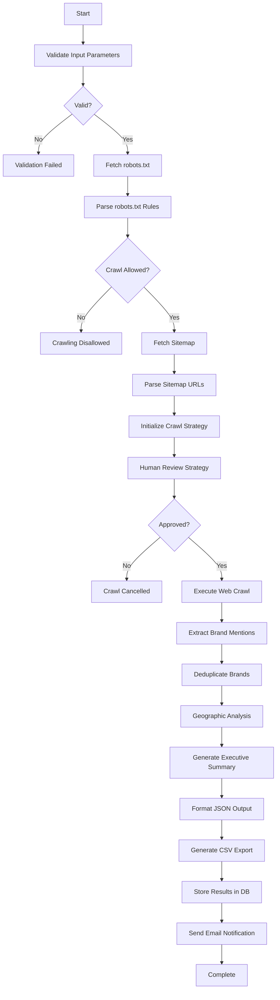

# Market Research & Data-Scraping Agent Workflow

A comprehensive workflow for crawling target websites and extracting brand mentions from clients, partners, case studies, testimonials, and blog posts with full respect to robots.txt and rate limits.

## 🎯 Overview

This workflow automates competitive intelligence and market research by:
- **Respecting robots.txt** and site crawl policies
- **Detecting gated content** and recording inaccessible pages
- **Throttling requests** to respect rate limits
- **Extracting brand mentions** with context and metadata
- **Deduplicating results** using fuzzy matching
- **Generating reports** in JSON and CSV formats
- **Human-in-the-loop approval** before large-scale crawls

## 🏗️ Workflow Architecture



## 📥 Input Parameters

| Parameter | Type | Required | Default | Description |
|-----------|------|----------|---------|-------------|
| `target_url` | string | Yes | - | Target website domain or landing URL |
| `max_pages` | number | No | 1000 | Maximum number of pages to crawl |
| `crawl_depth` | number | No | 4 | Maximum crawl depth from starting URL |
| `rate_limit_rps` | number | No | 1 | Rate limit in requests per second |
| `sitemap_only` | boolean | No | false | Only crawl URLs from sitemap.xml |
| `include_subdomains` | boolean | No | false | Include subdomains in crawl |
| `gated_credentials` | object | No | null | Optional credentials for gated content |
| `fuzzy_match_threshold` | number | No | 0.9 | Fuzzy matching threshold for deduplication (0-1) |

## 📤 Output Format

### JSON Output Structure

```json
{
  "success": true,
  "target_url": "https://www.example.com",
  "crawl_date": "2025-12-05T10:30:00Z",
  "parameters": {
    "max_pages": 1000,
    "crawl_depth": 4,
    "rate_limit_rps": 1
  },
  "summary": {
    "pages_crawled": 450,
    "pages_skipped": 50,
    "skip_reasons": {
      "disallowed": 20,
      "gated": 15,
      "error": 10,
      "duplicate": 5
    },
    "crawl_duration_seconds": 450,
    "total_brands_found": 87
  },
  "brands": [
    {
      "canonical_name": "Acme Corporation",
      "aliases": ["ACME", "Acme Inc.", "Acme Corp"],
      "total_mentions": 12,
      "source_urls": [
        "https://example.com/clients",
        "https://example.com/case-studies/acme"
      ],
      "page_types": ["clients", "case-study", "testimonial"],
      "best_context_snippet": "Acme Corporation has been using our platform since 2020...",
      "confidence_score": 0.95,
      "first_seen": "2025-12-05T10:32:15Z",
      "languages": ["en"]
    }
  ],
  "statistics": {
    "total_brands": 67,
    "total_mentions": 87,
    "pages_crawled": 450,
    "pages_skipped": 50
  },
  "analysis": {
    "geographic_distribution": {
      "north_america": 45,
      "europe": 15,
      "asia": 5,
      "other": 2,
      "unknown": 0
    },
    "industry_distribution": {
      "technology": ["Acme Corp", "TechStart"],
      "finance": ["Big Bank", "FinServ Inc"],
      "healthcare": ["MedCo"],
      "retail": ["ShopCo"],
      "manufacturing": [],
      "other": []
    },
    "notable_brands": ["Acme Corp", "TechStart", "Big Bank"]
  },
  "executive_summary": "...",
  "gated_pages": [
    {
      "url": "https://example.com/customer-portal",
      "reason": "Requires authentication"
    }
  ],
  "errors": []
}
```

### CSV Export

```csv
canonical_name,aliases,total_mentions,page_types,confidence_score,source_urls,best_context,first_seen,languages
Acme Corporation,"ACME;Acme Inc.;Acme Corp",12,"clients;case-study;testimonial",0.95,"https://example.com/clients;https://example.com/case-studies/acme","Acme Corporation has been using our platform since 2020...",2025-12-05T10:32:15Z,en
```

## 🚀 Deployment

### 1. Deploy to Database

```bash
cd workflows
node deploy-market-research-scraper.js
```

This will register the workflow template in MongoDB.

### 2. Verify Deployment

```bash
curl http://localhost:8000/api/templates/market-research-scraper-v1 \
  -H "Authorization: Bearer YOUR_TOKEN"
```

## 💻 Execution Examples

### Basic Execution

```bash
curl -X POST http://localhost:8000/api/universal/workflows/execute \
  -H "Authorization: Bearer YOUR_TOKEN" \
  -H "Content-Type: application/json" \
  -d '{
    "templateId": "market-research-scraper-v1",
    "input": {
      "target_url": "https://www.example.com"
    }
  }'
```

### Advanced Execution with Custom Parameters

```bash
curl -X POST http://localhost:8000/api/universal/workflows/execute \
  -H "Authorization: Bearer YOUR_TOKEN" \
  -H "Content-Type: application/json" \
  -d '{
    "templateId": "market-research-scraper-v1",
    "input": {
      "target_url": "https://www.competitor.com",
      "max_pages": 500,
      "crawl_depth": 3,
      "rate_limit_rps": 2,
      "sitemap_only": false,
      "include_subdomains": true,
      "fuzzy_match_threshold": 0.85
    },
    "metadata": {
      "project": "Q4 Competitive Intelligence",
      "analyst": "john.doe@company.com"
    }
  }'
```

### Execution with Gated Content

```bash
curl -X POST http://localhost:8000/api/universal/workflows/execute \
  -H "Authorization: Bearer YOUR_TOKEN" \
  -H "Content-Type: application/json" \
  -d '{
    "templateId": "market-research-scraper-v1",
    "input": {
      "target_url": "https://www.example.com",
      "gated_credentials": {
        "username": "research_account",
        "password": "secure_password"
      }
    }
  }'
```

## 🔄 Workflow Execution Flow

### Phase 1: Validation & Permission Check
1. **Validate Input** - Verify URL format and parameter ranges
2. **Fetch robots.txt** - Download and parse crawl rules
3. **Check Permissions** - Verify crawling is allowed
4. **Fetch Sitemap** - Discover URLs from sitemap.xml

### Phase 2: Strategy & Approval
5. **Initialize Strategy** - Create crawl plan with rate limiting
6. **Human Review** - Get approval for large-scale crawl
   - Shows estimated duration, page count, rate limits
   - Allows adjustments before execution

### Phase 3: Execution
7. **Execute Crawl** - Visit pages and extract content
8. **Extract Brands** - Identify brand mentions with context
9. **Deduplicate** - Merge similar brand names using fuzzy matching
10. **Analyze** - Geographic and industry analysis

### Phase 4: Output Generation
11. **Generate Summary** - Create executive report
12. **Format JSON** - Structure final JSON output
13. **Generate CSV** - Create downloadable CSV
14. **Store Results** - Push to vector DB (optional)
15. **Send Notification** - Email report to stakeholders

## 🛡️ Compliance & Ethics

### robots.txt Compliance
- ✅ Fetches and parses robots.txt before crawling
- ✅ Respects Disallow directives
- ✅ Honors Crawl-delay settings
- ✅ Stops immediately if crawling is prohibited

### Rate Limiting
- ✅ Default: 1 request/second (configurable)
- ✅ Respects crawl-delay from robots.txt
- ✅ Uses higher of user setting or site requirement
- ✅ Prevents overwhelming target servers

### Gated Content Handling
- ✅ Detects authentication requirements
- ✅ Records gated URLs without forcing access
- ✅ Only accesses gated content with explicit credentials
- ✅ Reports all access-denied pages

## 📊 Use Cases

### 1. Competitive Intelligence
Identify competitors' client lists and market positioning
```bash
input: { target_url: "https://competitor.com" }
```

### 2. Lead Generation
Discover companies using similar solutions
```bash
input: { 
  target_url: "https://industry-leader.com/customers",
  max_pages: 200
}
```

### 3. Market Research
Analyze market segments and geographic distribution
```bash
input: { 
  target_url: "https://market-leader.com",
  include_subdomains: true
}
```

### 4. Partnership Analysis
Identify potential partners based on existing relationships
```bash
input: { target_url: "https://ecosystem-leader.com/partners" }
```

## 🔍 Monitoring Execution

### Real-time WebSocket Updates

```javascript
import io from 'socket.io-client';

const socket = io('http://localhost:8000');

socket.on('execution_started', (data) => {
  console.log('Crawl started:', data.executionId);
});

socket.on('node_completed', (data) => {
  console.log('Node completed:', data.nodeName);
  console.log('Progress:', data.progress);
});

socket.on('human_review_required', (data) => {
  console.log('Awaiting approval:', data.taskId);
  // Display approval UI to user
});

socket.on('execution_completed', (data) => {
  console.log('Crawl complete!');
  console.log('Brands found:', data.outputs.statistics.total_brands);
});
```

### Check Execution Status

```bash
# Get execution details
curl http://localhost:8000/api/executions/{executionId} \
  -H "Authorization: Bearer YOUR_TOKEN"

# Get execution logs
curl http://localhost:8000/api/executions/{executionId}/logs \
  -H "Authorization: Bearer YOUR_TOKEN"
```

## 🎨 React Flow Canvas Integration

### Import to Noam Canvas

```bash
# Get workflow in ReactFlow format
curl http://localhost:8000/api/templates/market-research-scraper-v1/reactflow \
  -H "Authorization: Bearer YOUR_TOKEN"
```

### Export from Noam Canvas

```bash
# Save custom workflow from canvas
curl -X POST http://localhost:8000/api/templates/import/reactflow \
  -H "Authorization: Bearer YOUR_TOKEN" \
  -H "Content-Type: application/json" \
  -d @custom-scraper-workflow.json
```

## 🧪 Testing

### Test with Example.com

```bash
curl -X POST http://localhost:8000/api/universal/workflows/execute \
  -H "Authorization: Bearer YOUR_TOKEN" \
  -H "Content-Type: application/json" \
  -d '{
    "templateId": "market-research-scraper-v1",
    "input": {
      "target_url": "https://example.com",
      "max_pages": 10,
      "crawl_depth": 2
    }
  }'
```

## 📋 Environment Variables

Add to your `.env` file:

```bash
# Vector DB (Optional)
VECTOR_DB_ENDPOINT=https://your-vector-db.com/api
VECTOR_DB_API_KEY=your_api_key

# Email Notifications (Optional)
NOTIFICATION_EMAIL=research-team@company.com
SMTP_HOST=smtp.gmail.com
SMTP_PORT=587
SMTP_USER=your_email@gmail.com
SMTP_PASSWORD=your_app_password
```

## 🚨 Error Handling

The workflow handles multiple error scenarios:

| Error Type | Action Taken |
|------------|--------------|
| Invalid URL | Workflow stops, returns validation error |
| robots.txt disallows | Workflow stops, reports restriction |
| Site unavailable | Retries with exponential backoff |
| Rate limit exceeded | Throttles requests, respects limits |
| Gated content | Records URL, continues without forcing access |
| Parse errors | Logs error, continues with next page |

## 📈 Performance

- **Crawl Speed**: ~1-10 pages/second (configurable)
- **Duration**: 30-60 minutes for 500-1000 pages
- **Memory**: ~200-500MB for large crawls
- **Storage**: ~1-5MB per 100 brands (JSON + CSV)

## 🔐 Security Considerations

- ✅ Never stores sensitive credentials
- ✅ Respects site access controls
- ✅ Doesn't bypass authentication
- ✅ Follows ethical scraping practices
- ✅ Rate limiting prevents DoS
- ✅ Human approval for large crawls

## 🤝 Contributing

To extend this workflow:

1. Edit `market-research-scraper-workflow.json`
2. Add new nodes or modify existing ones
3. Update edges to reflect new flow
4. Redeploy: `node deploy-market-research-scraper.js`

## 📝 License

Part of the LangChain Workflow Orchestrator project.

## 🆘 Support

For issues or questions:
- Check execution logs: `/api/executions/{executionId}/logs`
- Review workflow template: `/api/templates/market-research-scraper-v1`
- Contact: support@your-domain.com

---

**Built with LangGraph + LangChain + Universal Workflow Engine** 🚀
